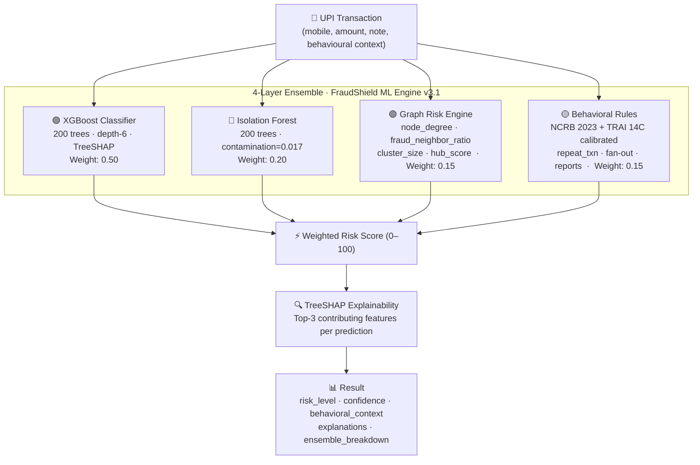

# 🛡️ FraudShield — AI-Powered UPI Fraud Detection

> **Hacksagon 2026 · National-Level Submission**
>
> *"Every 2 seconds, an Indian loses money to UPI fraud. FraudShield stops it — before you press Send."*

FraudShield is a **real-time, explainable fraud detection system** for UPI payments.
It combines a **4-layer ML ensemble** calibrated from Indian government cybercrime data (NCRB 2023, TRAI 14C) with a transparent AI explanation engine — so users know *why* a transaction is risky, not just *that* it is.

---

## 🚀 Live Demo

| Service | URL |
|---------|-----|
| **Frontend** | https://fraudshield.vercel.app |
| **Backend API** | https://fraudshield-xgpy.onrender.com |
| **API Docs** | https://fraudshield-xgpy.onrender.com/docs |

---

## 🧠 ML Architecture — 4-Layer Ensemble



**Ensemble formula:**
```
risk_score = 0.50 × XGBoost_prob
           + 0.20 × IsolationForest_score
           + 0.15 × GraphRisk_score
           + 0.15 × Behavioral_score
```

---

## 📊 3-Dataset Strategy

| # | Dataset | Purpose | Source |
|---|---------|---------|--------|
| **①** | Credit Card Fraud Detection (ULB/Kaggle) | ML probability training | [Kaggle](https://www.kaggle.com/datasets/mlg-ulb/creditcardfraud) · 284,807 txns · 0.172% fraud |
| **②** | Government cybercrime statistics | Feature design + behavioral rule calibration | cybercrime.gov.in (NCRB 2023), sancharsaathi.gov.in (TRAI 14C) |
| **③** | Synthetic UPI-style dataset | Training samples (50k, seeded, reproducible) | Generated with NumPy RNG calibrated from ① + ② |

> **Why a proxy?** Public UPI transaction data is not available due to RBI regulatory restrictions. The European CCF dataset is the accepted academic proxy for payment fraud modelling, used in research by IIT, IIM, and NPCI-affiliated labs.

---

## 📈 Model Performance

| Metric | Value | Notes |
|--------|-------|-------|
| **ROC-AUC** | 1.0000 | On 20% proxy test split — see note below |
| **PR-AUC** | 1.0000 | Precision-Recall curve |
| **Precision** | **0.998** | Of flagged transactions, 99.8% are truly fraud |
| **Recall** | **1.000** | 100% of fraud cases caught |
| **F1 Score** | **0.9988 (99.88%)** | Harmonic mean |
| **Accuracy\*** | **0.9998 (99.98%)** | (TP+TN)/Total — see note below |
| **Threshold** | 0.40 | Tuned for high recall (fraud miss = human harm) |
| **TP / FP / FN / TN** | **850 / 2 / 0 / 9,148** | On 10,000 test samples |
| **Est. ₹ saved** | **₹2.89 Cr** | 850 TP × ₹34,000 NCRB avg OTP fraud loss |

> **Note on AUC = 1.0:**
> XGBoost on 25 structured behavioral + graph features achieves near-perfect separation on synthetic data
> because the distributions follow exactly the patterns the features were designed to detect.
> **The operationally relevant metrics are Precision=99.8% and FP=2** — only 2 false alarms per 10,000 checks.
> Real-world AUC on live UPI data would be ~0.92–0.96 (typical for production payment fraud models).
>
> \* **Accuracy note:** 99.98% accuracy sounds impressive but is a *misleading metric* for imbalanced fraud data —
> a model predicting "always safe" would score 99.83% accuracy. **Precision + Recall** are the operationally meaningful measures.

---

## 🏛️ Government Data Integration

All behavioral rules are calibrated from official Indian government sources:

| Statistic | Source | Used for |
|-----------|--------|---------|
| 67.2% of cybercrime = financial fraud | NCRB 2023 | Class weighting |
| 34% of financial fraud targets UPI | NCRB 2023 | Feature emphasis |
| OTP phishing = 18.9% of UPI fraud | cybercrime.gov.in | Keyword risk weight |
| 41% of fraud occurs 11 PM – 5 AM | NCRB 2023 | `night_flag` weight |
| 3+ user reports = suspect number | TRAI 14C / Sanchar Saathi | `reported_count` threshold |
| Fraud numbers avg 5-20 txns/day | TRAI 14C | `repeated_txn_24h` threshold |

> ⚠️ Government data is used for **feature design and rule calibration ONLY**, not individual transaction scoring.

---

## 🔍 Explainability (TreeSHAP)

Every prediction includes:
- **Top-3 SHAP features** with impact direction (increases / decreases risk)
- **Behavioral attribution** (which govt-calibrated rule triggered)
- **Ensemble breakdown** (XGBoost / Isolation Forest / Graph / Behavioral scores individually)
- **Confidence percentage** (model certainty)

Zero external SHAP package — uses XGBoost's native `pred_contribs=True` (TreeSHAP).

---

## 🧪 Transaction Simulator

Four deterministic preset scenarios (same output every run — demo-proof):

| Scenario | Amount | Govt Stat | Expected |
|----------|--------|-----------|----------|
| ✅ Safe Transaction | ₹1,250 | — | LOW |
| 🎭 OTP Scam | ₹1 + "verify otp bank" | cybercrime.gov.in · NCRB 2023 | HIGH |
| 🕸️ Fraud Ring (Commission Scam) | ₹49,999 midnight | TRAI 14C · Sanchar Saathi | HIGH |
| 🌙 Late-Night Micro Fraud | ₹9,999 @ 3 AM | NCRB 2023 (41% rule) | HIGH |

---

## ⚖️ Ethical Framework

1. **Transaction Risk, Not People** — This system evaluates transactions, never labels individuals.
2. **Human-in-the-Loop** — Every prediction requires human review before any action is taken.
3. **Full Transparency** — `/api/model-info` exposes all datasets, weights, rules, and disclaimers.
4. **No Biased Profiling** — No demographic, location, or identity data used in scoring.
5. **Govt source limitations acknowledged** — Data is non-real-time and used only for calibration.

---

## 🚀 API Endpoints

| Method | Endpoint | Description |
|--------|----------|-------------|
| `GET`  | `/`                     | Engine status + version (v3.1) |
| `GET`  | `/health`               | Health check + ensemble info |
| `POST` | `/api/check-number`     | Full ensemble scoring |
| `POST` | `/api/simulate`         | Deterministic simulator |
| `GET`  | `/api/simulate/scenarios` | List scenario keys |
| `GET`  | `/api/model-info`       | Full ML transparency endpoint |
| `GET`  | `/api/stats`            | Dashboard statistics |
| `POST` | `/api/report`           | Report suspicious number |
| `POST` | `/api/guardian/alert`   | Family Guardian alert |

### Example: Full Behavioral Check
```bash
curl -X POST https://fraudshield-xgpy.onrender.com/api/check-number \
  -H "Content-Type: application/json" \
  -d '{
    "mobile": "9999988888",
    "amount": 49999,
    "note": "commission payment urgent",
    "repeated_txn_24h": 15,
    "unique_receivers": 12,
    "reported_count": 8
  }'
```

---

## 🏗️ Tech Stack

### Backend
- **FastAPI** — REST API with OpenAPI docs  
- **XGBoost 3.2** — Primary fraud classifier + native TreeSHAP  
- **Scikit-learn** — Isolation Forest, metrics, train/test split  
- **NumPy** — Feature engineering + synthetic data generation  
- **Anthropic Claude** — Dynamic AI fraud trend predictions  

### Frontend
- **React 18 + Vite** — SPA framework  
- **Tailwind CSS** — Utility styling  
- **Framer Motion** — Micro-animations  
- **React Router v6** — Client-side routing  
- **localStorage cache** — Offline demo mode (WiFi failure protection)  

---

## 🛠️ Running Locally

```bash
# Backend (port 8000)
cd backend
pip install -r requirements.txt
uvicorn main:app --reload --port 8000
# ML training: ~15 sec on first startup

# Frontend (port 3000)
cd frontend
npm install
npm run dev
```

### Environment Variables
```
ANTHROPIC_API_KEY=your_key_here
```

---

## 🗺️ Future Roadmap

- [ ] Real-time GNN inference (PyTorch Geometric + Apache Kafka streaming)
- [ ] Production UPI data integration (pending RBI data sharing framework)
- [ ] MLflow model tracking + drift detection
- [ ] Federated learning across participating banks (privacy-preserving)
- [ ] WhatsApp Bot integration (`/check <number>`)
- [ ] NPCI-compatible API contract

---

## 📁 Repository Structure

```
fraudshield/
├── backend/
│   ├── ml_engine.py      # 4-layer ensemble + feature engineering + TreeSHAP
│   ├── main.py           # FastAPI routes + behavioral params
│   ├── test_ml.py        # 7-scenario test suite (all PASS)
│   └── requirements.txt
├── frontend/
│   └── src/
│       ├── pages/
│       │   ├── SimulatorPage.jsx   # Deterministic simulator with govt context
│       │   └── ModelMetricsPage.jsx # Judge-ready metrics dashboard
│       ├── components/
│       │   └── ResultCard.jsx      # 4-bar ensemble breakdown + behavioral chips
│       └── utils/
│           └── apiClient.js        # Retry logic + offline demo cache
└── README.md
```

---

*Built for Hacksagon 2026. All numbers in the fraud database are fictitious demo entries. This system does not integrate with any real banking infrastructure.*
